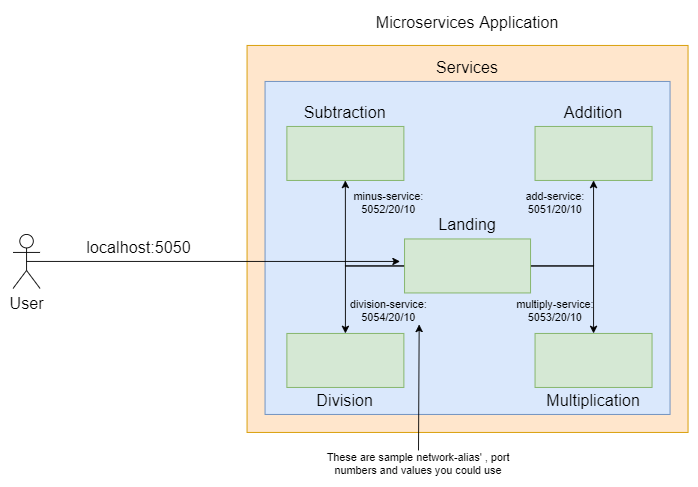

<a name="readme-top"></a>

# Mono-2-Micro

The project ```M2M``` stands for ```Monolith-2-Microservices```.
It consists of ```breaking down Monoliths into Microservices```.

<details>
  <summary color= blue >Table of Contents</summary>
<li>Summary</li>
<li> Prerequisites and Techstack</li>
<li> Steps for Execution</li>
<li> Usage</li>
<!--<li>Contributing</li>-->
</details>
</br>

## Summary
This project has the following objectives:
- Get familiar with reading error stack trace and debugging code.
- Convert a monolith architecture based docker-compose application into a microservices based architecture.

- ### Monolith architecture diagram
<p align="center">
  
</p>


<p align="right">(<a href="#readme-top">back to top</a>)</p>
</br>

## Prerequisites and Techstack
* Python
* Docker 
  - [docker](https://docs.docker.com/engine/)
  -  [docker-compose](https://docs.docker.com/compose/install/)
  -   Follow the guides based on your operating system.
- Internet
  - Pull docker image `python:3.8-alpine` beforehand to avoid connectivity issues.

<p align="right">(<a href="#readme-top">back to top</a>)</p>
</br>


## Steps for Execution

* Build & Run
```
# under the microservices directory
# NOTE: For any code changes to be reflected, the build command must be rerun, and then up
docker-compose build
# run without the -d flag incase you want to observe the logs
docker-compose up -d
```
* To stop the services in detached mode
```
docker-compose down
```

<p align="right">(<a href="#readme-top">back to top</a>)</p>
</br>

## Usage
* Mono-2-Micro project can be used to break monoliths into microservices.
* This is crucial to upload applications on cloud.
* Thereby this project helps in converting stand-alone applications into cloud-based or cloud-supported applications.
  
### Microservices-based architecture diagram
<p align="center">
  
  
<h7 align="center">The diagram only shows the services already defined within the microservice architecture for visualization purposes. More services can also be added.</h7>

</p>

<p align="right">(<a href="#readme-top">back to top</a>)</p>
</br>


